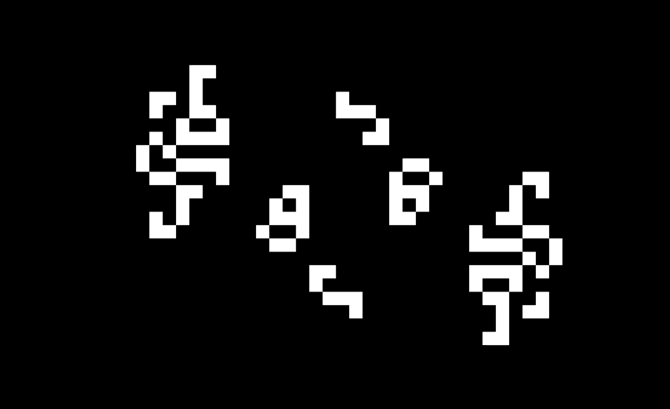
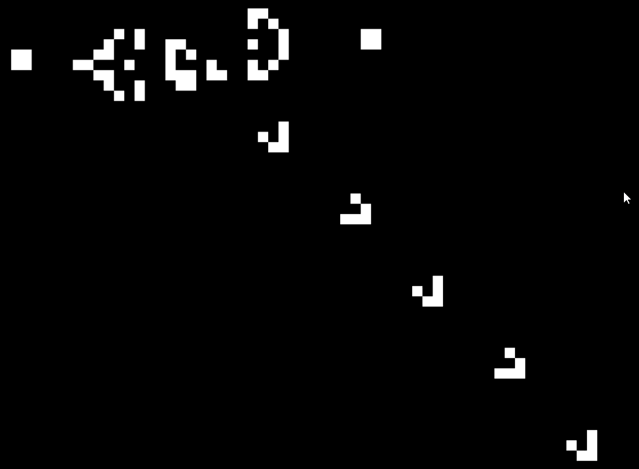

# Conway's Game of Life

A Conway's Game of Life simulation written in Rust, rendered with [Macroquad](https://macroquad.rs/).

### Cribbage Pattern


### Glider Gun


## About

Conway's Game of Life is a cellular automaton where cells on a 2D grid live or die based on four simple rules:

- A live cell with fewer than 2 live neighbors dies (underpopulation)
- A live cell with 2 or 3 live neighbors survives
- A live cell with more than 3 live neighbors dies (overpopulation)
- A dead cell with exactly 3 live neighbors becomes alive (reproduction)

## Patterns

| Pattern | Description |
|--------|-------------|
| **Glider** | A small 5-cell pattern that moves diagonally across the grid |
| **Glider Gun** | Gosper's Glider Gun, periodically fires gliders |
| **Cribbage** | A cool infinite pattern that is called a period-19 oscillator |
| **Random** | Random initial population with ~15% cell density |

## How to Run

Requires [Rust](https://rustup.rs/) to be installed.

```bash
git clone https://github.com/Antkuz17/Conways_Game_of_Life.git
cd Conways_Game_of_Life
cargo run
```

To change the initial pattern, edit `src/main.rs` and call the desired pattern function before the game loop.

## Built With

- [Rust](https://www.rust-lang.org/)
- [Macroquad](https://macroquad.rs/) — for windowed rendering